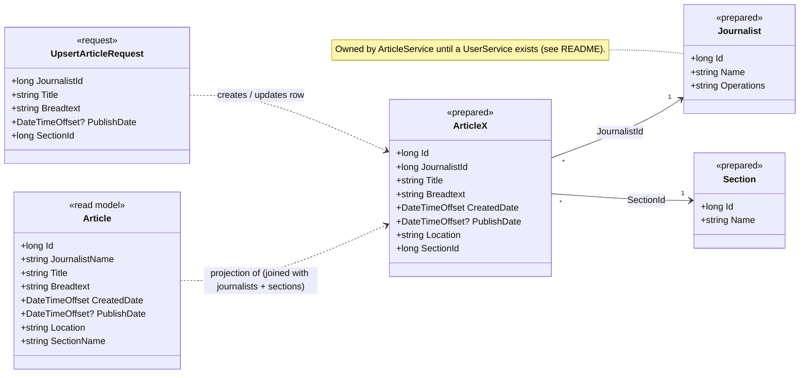

# L4 – ArticleService: models

Code-level view of the model layer in `apps/article_service/src/ArticleService/Models/Article.cs`.
See the L3 view `ArticleServiceComponents` in Structurizr for how the components use these models.

## Notes

- **`Article`** is what the API returns. `ArticleReadRepository` builds it by joining the
  `articles`, `journalists` and `sections` tables, so journalist and section are exposed by name.
- **`ArticleX`, `Journalist`, `Section`** (`<<prepared>>`) mirror the database tables but are not
  used in code yet – the repositories map straight into `Article`. They exist so the model is ready
  when other services start depending on journalists and sections.
- **`Location`** is the shard key (z-axis split): it decides which continent database the article lives in.
