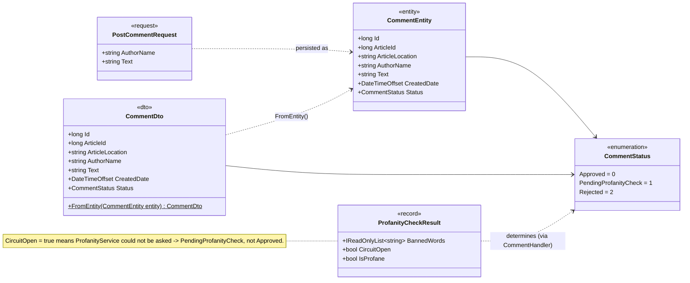

# L4 – CommentService: models

Code-level view of `apps/comment_service/src/CommentService/Models/` and the
`ProfanityCheckResult` record in `Profanity/IProfanityClient.cs`.
See the L3 view `CommentServiceComponents` in Structurizr for how the components use these models.

## Notes

- **`CommentEntity`** maps to the `comments` table; **`CommentDto`** is what the API returns.
  They are identical today, but the split keeps the API contract independent of the table layout.
- **`CommentStatus`** values are persisted as numbers and guarded by a CHECK constraint in
  `database/init/comment/comment_baseline.sql` – do not reorder the members.
- **`ProfanityCheckResult`** keeps `CircuitOpen` separate from `IsProfane`: "could not check" and
  "checked and clean" are different outcomes. This is what makes the fault-isolation fallback possible.
- `ArticleId` + `ArticleLocation` together identify an article across the ArticleService shards.
