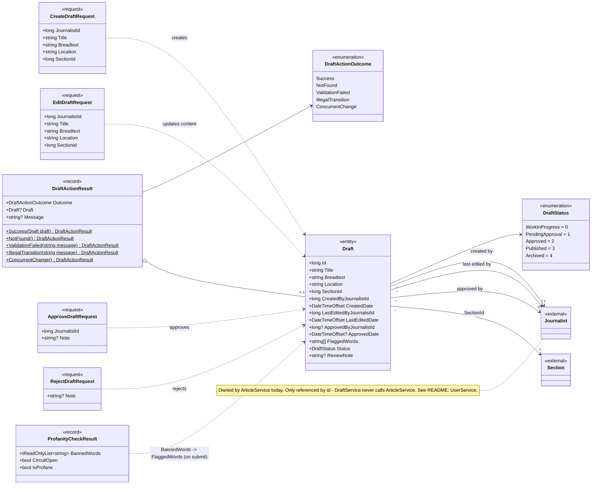

# L4 – DraftService: models

Code-level view of `apps/draft_service/src/DraftService/Models/Draft.cs`,
`Handlers/DraftActionResult.cs` and the `ProfanityCheckResult` record in `Profanity/IProfanityClient.cs`.
See the L3 view `DraftServiceComponents` in Structurizr for how the components use these models.

## Notes

- **Many journalists per draft:** a draft is created, edited and approved by (potentially) different
  journalists. This is not covered by the original design and is one of the reasons behind the
  suggested UserService (see [README](README.md)).
- **`Journalist` / `Section`** (`<<external>>`) are owned by ArticleService. DraftService only stores
  their ids, so nothing enforces that the ids exist.
- **Legal status transitions** between `DraftStatus` values are defined in `Workflow/DraftStatusTransitions.cs`
  (L3 component `DraftStatusTransitions`), not in the model itself.
- **`DraftActionResult`** carries a use-case outcome without depending on ASP.NET Core; `DraftsController`
  maps `DraftActionOutcome` to HTTP status codes.
- **`FlaggedWords`** is filled from ProfanityService on submit. If the circuit is open, the draft is still
  submitted, just without flagged words.
