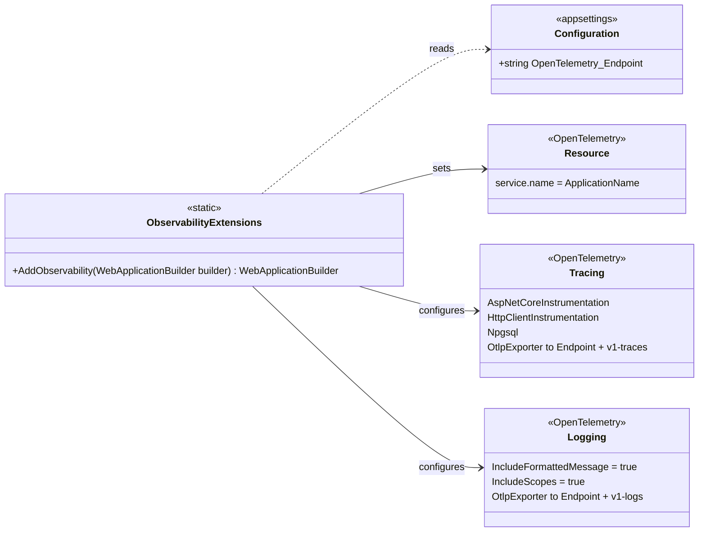

# L4 – Observability: shared library

Code-level view of `apps/shared/HappyHeadlines.Observability/ObservabilityExtensions.cs`.
The library is referenced by DraftService, CommentService and ProfanityService (the
`Observability` component in their L3 views) and is called once in each `Program.cs`:

```csharp
builder.AddObservability();
```

It is a build-time dependency only - there is no runtime coupling between the services.



## Notes

- **One endpoint key.** Services only set `OpenTelemetry:Endpoint` (the collector's OTLP/HTTP base
  URL, e.g. `http://otel-collector:4318`). The signal paths are added in code, because the OTLP
  exporter requires the full path when the endpoint is set explicitly over HTTP/protobuf.
- **Startup fails fast** if `OpenTelemetry:Endpoint` is missing (configuration error). A collector
  that goes down at runtime does not affect the service - the exporter batches in the background
  and drops data on failure.
- **Trace propagation** between services is automatic: the HttpClient instrumentation adds the W3C
  `traceparent` header, and the ASP.NET Core instrumentation in the receiving service reads it.
- **`Npgsql.OpenTelemetry` is pinned to `8.*`** to match the Npgsql version the services use.
- What may be logged is defined in `docs/logging.md` in the repository root.
