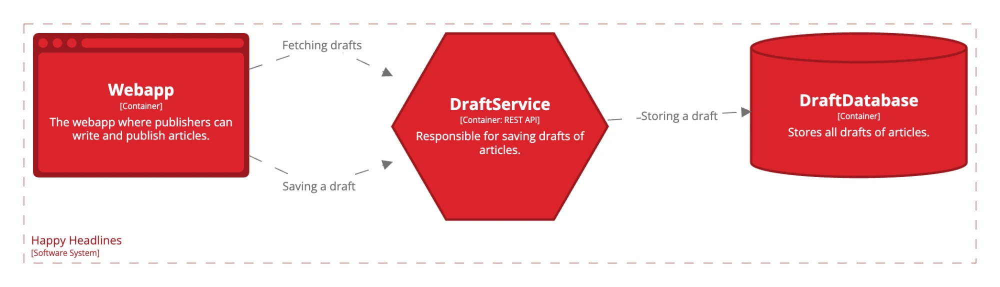

## Krav for gennemførelse

This week you must build your DraftService and the DraftDatabase with logging and tracing in mind.

Make sure to log and trace in a central repository that's reusable across the entire architecture and consider what to log and when.

