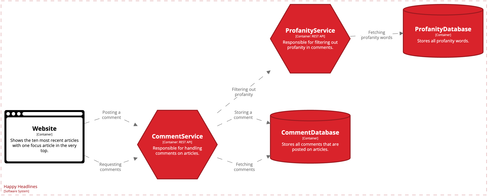

## Krav for gennemførelse

This week you are expected to implement CommentService, CommentDatabase, ProfanityService and ProfanityDatabase. The CommentService and the ProfanityService must be properly fault isolated following relevant principles of swimlanes.

In order to work with this properly your CommentService and ProfanityService must communicate directly without any gateway or UI as middlelayer. The following illustration is from my notes on the HappyHeadlines project.

Furthermore you are expected to implement a circuit breaker pattern into the CommentService to take over if the ProfanityService is no longer available.
