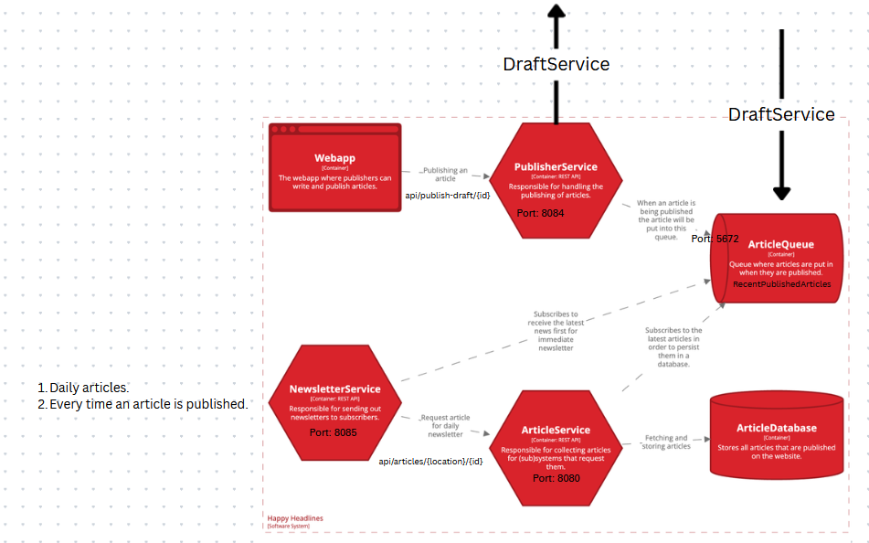
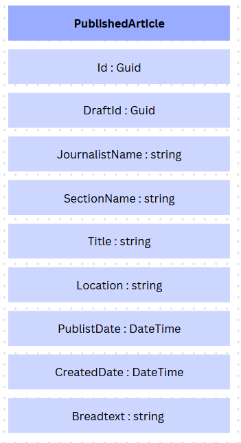

## Krav for gennemførelse

This week you have quite a few services to implement - while doing so your primary focus must be on the distributed tracing part of "Design to be monitored".

Make sure the traces are not broken when crossing service boundaries and that all traces are collected and stored centrally.

