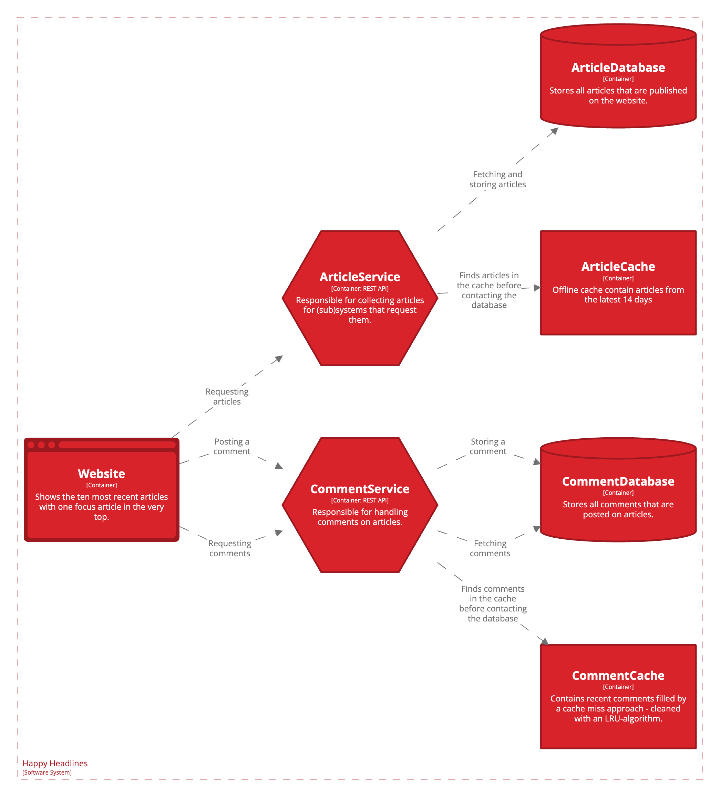

## The history

In order to fully understand these requirements you will have to complete the resources of this week.
HappyHeadlines have experienced availability issues on certain articles, and users in Europe have been complaining about slow response times when trying to access certain articles.

After investigating the issue the IT department has found the bottleneck. The problem arised after doing the z-axis split on the article database into different continents and then having one database along the other for global news. However the global-instance of the database is geographically placed in North America and not replicated to other areas of the world.

The Architectural Review Board (ARB) discussed different solution proposals, including an x-axis split of the database with the new replica placed in Europe and potential in other parts of the world. This proposal was turned down due to the costs of establishing and maintaining the databases in Europe, and potentially also in other regions later on.

The ARB approved another proposal suggesting to implement cache layers in certain areas of the application. The ArticleService and CommentService are already replicated to different regions of the world, but are all communicating with a database instance in North America.
To improve the availability a caching layer is to be introduced between the ArticleService and the global ArticleDatabase, but also between the CommentService and the CommentDatabase.

The ArticleCache must use an offline process to periodically fill the cache with articles from the latest 14 days.

The CommentCache will use a cache miss approach to fill the cache. This cache is limited to contain all comments for the most recently 30 accessed articles. When the cache is full the LRU-algorith is used to clean up the cache.

## Your job

Implement the two mentioned cache layers. You have the autonomy to decide if you want to implement a caching mechanism yourself or use existing tools like (but not limited to) Redis and MemCached.

Furthermore as a part of HappyHeadlines’ monitoring-strategies you are expected to implement a small dashboard displaying useful information about the cache hit ratio of each of the two cache layers. Again you have the autonomy to decide if you implement the dashboard yourself or use existing tools like (but not limited to) Grafana and Prometheus.

## Presentation

This is a compulsory assignment meaning you have to complete it and get it approved by me in order to attend the exam by the end of the semester.
To pass you have to present your solution to a group of class mates on Zoom. I'll not be in the room while you are presenting, but the Zoom-room is automatically recording the meeting for later evaluation.

Each participant must present their solution with screen sharing active for no more than 10 minutes. When all partipants have presented you are supposed to ask questions of curiousity to one or more of the other participants.

Each participant will receive an individual failed/passed grade based on both the presentation and the follow-up questions.

The following rules apply:

- You must only use the Zoom-room in the specified timeslot - don't enter before and make sure to leave before to make space for the next group.
- You must be present on webcam for the full duration of the meeting.
- In the beginning of the meeting tell your name and give a short introduction of yourself to your group members.
